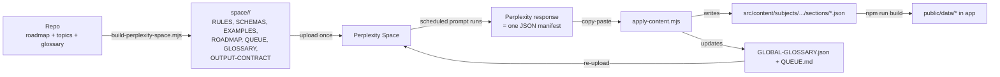

# Perplexity Content Pipeline

This folder contains everything needed to generate LearnWithDeiva learning content
using a Perplexity Space (plus a scheduled or on-demand query) instead of running
agentic generation inside Cursor.

The goal is quality parity with Cursor-generated content at a fraction of the token
cost, by:

1. Packaging the repo's rules, schemas, roadmap, and a global glossary into Space
   files that Perplexity can read on every query.
2. Constraining Perplexity to a strict JSON output contract — one **manifest** per
   sub-subtopic.
3. Validating and applying that manifest back into the repo with a single local
   script.

---

## Source-of-truth split

| Layer | What lives there | Who writes it |
| --- | --- | --- |
| **Repo (canonical)** | `src/content/subjects/<id>/roadmap.json`, every `topics/<topic-id>/topic.json`, every `sections/*.json`, subject-level `glossary.json` | You, via `apply-content.mjs` after each accepted Perplexity batch |
| **Space (derived)** | Condensed roadmap, flattened global glossary, gold-standard examples, rules, schemas, queue, output contract | `build-perplexity-space.mjs` (Part 2) emits a `space/<subject>/` folder; you upload it |
| **Perplexity response (derived, single-shot)** | One JSON manifest per sub-subtopic | The scheduled query, using the prompt in [scheduled-query-prompt.md](scheduled-query-prompt.md) |
| **App data (built)** | `public/data/**` | The existing `scripts/gen-content.mjs` (untouched by this pipeline) |

---

## End-to-end flow



---

## Folder layout

```
docs/perplexity/
├── README.md                         (this file)
├── scheduled-query-prompt.md         the literal prompt you paste into Perplexity
└── space-files/                      every file in here goes into the Space
    ├── RULES.md                      non-negotiables, section selection, completeness, examples-in-sections
    ├── SECTION-SCHEMAS.md            all 24 section keys + their JSON shape + good/bad examples
    ├── OUTPUT-CONTRACT.md            the manifest schema with one full worked example
    └── IMAGE-POLICY.md               prefer mermaid + charts; images.json only when essential
```

The runtime artefacts that depend on the repo (`ROADMAP-*.md`, `GLOBAL-GLOSSARY.json`,
`QUEUE.md`, `EXAMPLES.md`) are produced by [scripts/build-perplexity-space.mjs](../../scripts/build-perplexity-space.mjs)
into a gitignored `space/<subject>/` folder. The static contract files in
`space-files/` are simply copied alongside them so a single upload covers everything.

---

## One-time Perplexity Space setup

1. Open Perplexity → **Spaces** → **New Space**, name it `LearnWithDeiva — <Subject>`
   (e.g. `LearnWithDeiva — Gen AI`). One Space per subject.
2. Set the Space's instructions to:

   > Always follow `RULES.md`, `SECTION-SCHEMAS.md`, `OUTPUT-CONTRACT.md`, and
   > `IMAGE-POLICY.md` in the attached files. Always output exactly one fenced
   > ```json block matching the manifest contract, and nothing else.

3. Upload every file from `space/<subject>/` (produced by `build-perplexity-space.mjs`):
   - `RULES.md`
   - `SECTION-SCHEMAS.md`
   - `OUTPUT-CONTRACT.md`
   - `IMAGE-POLICY.md`
   - `ROADMAP-<subject>.md`
   - `GLOBAL-GLOSSARY.json`
   - `QUEUE.md`
   - `EXAMPLES.md`
4. Create a **Scheduled Search** in the Space. Paste the entire body of
   [scheduled-query-prompt.md](scheduled-query-prompt.md) as the prompt. Pick a
   schedule that suits your throughput (e.g. once per hour). You can nudge the
   queue by changing the schedule time so a run happens sooner.

---

## Per-batch authoring loop

After the first run lands a manifest in your scheduled search results:

```bash
# 1. Save the manifest body (the contents of the single ```json block) to disk:
pbpaste > /tmp/manifest.json     # macOS; on Linux use xclip -o or just paste into a file

# 2. Dry-run first to see what would be written and which checks fail:
npm run apply:content -- --dry-run --file /tmp/manifest.json

# 3. Apply for real (writes files, merges glossary, updates QUEUE.md):
npm run apply:content -- --file /tmp/manifest.json

# 4. Build the app data to view it locally:
npm run build
```

After applying, the script will tell you which Space files changed and need
re-uploading. Typically just `QUEUE.md` and (when new terms were merged)
`GLOBAL-GLOSSARY.json`. Replace them in the Space, then the next scheduled run
will pick up the next sub-subtopic.

---

## Why this stays quality-parity with Cursor

- Every Perplexity query gets the *full* rule set, every section schema with
  good/bad examples, and 2–3 gold-standard sub-subtopics inline as few-shot.
- Perplexity sees the *current* global glossary in the Space, so it does not
  re-invent terms that already exist.
- The apply script enforces every structural rule the agent might fudge:
  section-key whitelist, per-section schema, mermaid lint, question-pattern
  completeness, glossary dedupe.
- On any validation failure the apply script aborts before touching the repo,
  so a bad manifest never corrupts existing content.

---

## Out of scope (kept in Cursor)

- Roadmap authoring (`roadmap.json`) — too cross-cutting for a single sub-subtopic
  query.
- App feature work, refactors, schema changes, and build-pipeline edits.
- Image fulfilment when `imageTasks` is non-empty — Perplexity returns a prompt
  and suggested sources; you generate or download the file separately and drop
  it under `public/content-assets/<topicId>/`. See [space-files/IMAGE-POLICY.md](space-files/IMAGE-POLICY.md).
