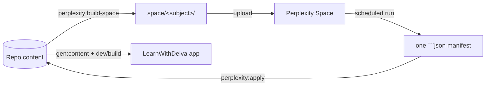

# USAGE — generating LearnWithDeiva content with Perplexity

The day-to-day playbook for producing learning content via a Perplexity Space
(or scheduled query) instead of running agentic generation inside Cursor.

This is the **end-user** doc. For the architecture / why, see
[README.md](README.md). For the rules / schemas you upload to the Space, see
[space-files/](space-files/). For the very first pilot, see
[PILOT-NOTES.md](PILOT-NOTES.md).

---

## Mental model

One Perplexity scheduled run = **one sub-subtopic of content**.



Everything else — the Space file set, the rules, the manifest schema — exists
to make Perplexity produce content that drops into the repo without manual
editing.

---

## One-time setup per subject

You do this once for each subject (e.g. `gen-ai`, `python`, `react`).

### 1. Build the Space bundle

```bash
# Whole subject (every stage):
npm run perplexity:build-space -- --subject gen-ai

# Or just one stage (recommended for the first run):
npm run perplexity:build-space -- --subject gen-ai --stage computing-foundations

# Pick your own example sub-subtopics instead of auto-picking:
npm run perplexity:build-space -- --subject gen-ai --stage computing-foundations \
  --examples programming-basics--operators-and-expressions,python-syntax-idioms--decorators
```

This creates `space/<subject>/` (gitignored) with everything Perplexity needs.

### 2. Create the Perplexity Space

1. Perplexity → **Spaces** → **New Space**.
2. Name it `LearnWithDeiva — <Subject>` (one Space per subject).
3. Set the Space's **system instructions** to:

   > Always follow `RULES.md`, `SECTION-SCHEMAS.md`, `OUTPUT-CONTRACT.md`, and
   > `IMAGE-POLICY.md` in the attached files. Always output exactly one fenced
   > ```json block matching the manifest contract, and nothing else.

4. Upload every file in `space/<subject>/` to the Space.

### 3. Configure the scheduled search

1. In the Space, **Create Scheduled Search**.
2. Paste the body of [scheduled-query-prompt.md](scheduled-query-prompt.md)
   into the prompt field (exclude the `--- PROMPT START/END ---` markers).
3. Pick a frequency that suits your throughput. Daily is a good baseline.
4. Save.

> **Available on:** Perplexity Pro / Max. Free accounts don't expose
> scheduled tasks; in that case treat the prompt as an on-demand query you
> trigger manually inside the Space.

---

## Per-batch loop (the daily workflow)

Each scheduled run produces one manifest. Here's what to do with it.

### 1. Capture the manifest

When the scheduled run completes, open the result. It should be exactly one
```json fenced block. Copy the whole response (fences included is fine).

```bash
pbpaste > /tmp/manifest.json                              # macOS
# or:
xclip -selection clipboard -o > /tmp/manifest.json        # Linux
```

### 2. Dry-run first

```bash
npm run perplexity:apply -- --file /tmp/manifest.json --dry-run
```

The output shows the scope, planned writes, glossary delta, and any
validation errors. Fix problems before applying for real.

Common dry-run findings and what to do:

| What you see | What it means | What to do |
| --- | --- | --- |
| `Note: manifest had non-strict input ... Recovered automatically.` | Perplexity added fences/smart quotes/trailing commas | Nothing — script handled it; consider tightening the prompt if frequent |
| `files[i].path must start with ...` | Perplexity wrote outside the intended sub-subtopic | Edit `QUEUE.md` so the right entry is first; re-upload; rerun |
| `5w1h MUST contain exactly 6 items` | Pattern incompleteness | Re-run the query OR strip that pattern from the manifest |
| `Glossary conflicts (refusing to merge without --force)` | A new term clashes with an existing definition | Reconcile manually (edit existing source), or re-run with `--force` if the new wording is better |
| `mermaid: reserved keyword "end"` | Mermaid lint hit | Edit the diagram (rename node) or drop `diagrams.json` from the manifest |

### 3. Apply for real

```bash
npm run perplexity:apply -- --file /tmp/manifest.json
```

The script:

- Writes every validated `files[i]` to disk.
- Merges new terms into `space/<subject>/GLOBAL-GLOSSARY.json` (dedupe on
  case-insensitive `term`).
- Marks completed sub-subtopics as `[x]` in `space/<subject>/QUEUE.md`.
- Prints a next-step checklist (re-upload, image tasks).

### 4. Refresh the Space

The Space's `QUEUE.md` and `GLOBAL-GLOSSARY.json` are now out-of-date relative
to your local files. Re-upload the changed files to the Space (replace the
existing copies). Future scheduled runs will pick the next entry and avoid the
glossary terms you just added.

### 5. Build & view

```bash
npm run gen:content     # refresh public/data
npm run dev             # http://localhost:5173
```

### 6. Nudge the next run (optional)

Each scheduled run = one sub-subtopic. To process more than one per day:

- Edit the schedule's next-run time (e.g. set it to 1 minute from now).
- Or upgrade the cadence (hourly).
- Or trigger manually inside the Space.

---

## Image tasks

The prompt is biased toward Mermaid diagrams and data charts, so most
manifests will have `imageTasks: []`. When Perplexity DOES emit
`images.json`, the apply script prints each entry as a TODO with:

- the `src` path the app expects under `public/`,
- the `alt` text,
- a generator/sourcing `prompt`,
- optional `suggestedSources` URLs.

### Option A — fetch suggested sources

```bash
# Dry-run first to see what would download where:
npm run perplexity:fetch-images -- --file /tmp/manifest.json --dry-run

# Real fetch (skips files that already exist):
npm run perplexity:fetch-images -- --file /tmp/manifest.json
```

The helper downloads the FIRST URL in `suggestedSources` to `public/<src>`,
honouring `Content-Type` (`image/*` / svg / octet-stream) and a 10 MB cap.
Always inspect what was downloaded before committing — it does no licence
detection.

### Option B — generate

Use your image-gen tool of choice with the `prompt` field. Save the file at
the exact path Perplexity declared in `src` (which is always
`public/content-assets/<subject>/<subsubtopicId>/<filename>.<ext>`).

### Option C — skip and improve the rules

If Perplexity keeps emitting low-value images, edit
[space-files/IMAGE-POLICY.md](space-files/IMAGE-POLICY.md) to be stricter and
re-upload it.

---

## Reconciling glossary conflicts

`space/<subject>/GLOSSARY-CONFLICTS.md` is produced whenever the build script
finds a term defined in two places with different wording. It's
informational. To resolve:

1. Decide which definition is canonical (usually the most precise / repo-wide
   one).
2. Edit the conflicting `sections/<topic>/synonyms.json` so all copies of the
   term match the canonical wording.
3. Re-run `perplexity:build-space`.
4. Re-upload `GLOBAL-GLOSSARY.json` to the Space.

---

## Refreshing the bundle when the repo changes

Anything you change in the repo that affects the Space is invisible to
Perplexity until you re-upload. Rebuild and re-upload after:

- Editing `roadmap.json` or any `topic.json` (the flattened roadmap will be
  stale).
- Adding/removing topics (the `QUEUE.md` will be stale).
- Editing any `sections/synonyms.json` or subject `glossary.json` (the
  `GLOBAL-GLOSSARY.json` will be stale).
- Editing any file under [docs/perplexity/space-files/](space-files/) or
  [docs/perplexity/scheduled-query-prompt.md](scheduled-query-prompt.md) (the
  contract files will be stale).

```bash
npm run perplexity:build-space -- --subject <subject>
# Then re-upload the 5–10 files in space/<subject>/ to the Space.
```

---

## Adding a brand-new sub-subtopic

If Perplexity is asked to generate content for a sub-subtopic that doesn't
yet have a `topic.json` in the repo, the apply script refuses by default
(safety against typos / hallucinated topic ids). To intentionally bootstrap
a new sub-subtopic:

1. Author its `src/content/subjects/<subject>/topics/<id>/topic.json` first
   (with the right `parentId`, `level`, etc.).
2. Re-run `perplexity:build-space` so the new id appears in `QUEUE.md`.
3. Re-upload `QUEUE.md` and `ROADMAP-<subject>.md` to the Space.
4. Wait for the next run.

If you truly need to apply a manifest before that scaffold exists, pass
`--allow-new`:

```bash
npm run perplexity:apply -- --file /tmp/manifest.json --allow-new
```

…and remember to create the `topic.json` afterwards.

---

## Quick reference — npm scripts

| Command | Purpose |
| --- | --- |
| `npm run perplexity:build-space -- --subject <id> [--stage <stageId>] [--examples a,b,c]` | Build the Space bundle |
| `npm run perplexity:apply -- --file <manifest.json> [--dry-run] [--force] [--allow-new]` | Apply a manifest |
| `npm run perplexity:fetch-images -- --file <manifest.json> [--dry-run] [--overwrite]` | Optional: fetch suggested image sources |
| `npm run gen:content` | Rebuild `public/data/**` after applying |
| `npm run dev` | Run the app locally (http://localhost:5173) |
| `npm run build` | Type-check + production build |

---

## When to stop using Perplexity and go back to Cursor

Perplexity is great for the per-sub-subtopic body of work. Keep the following
in Cursor:

- Roadmap edits (`roadmap.json`).
- Cross-cutting refactors and schema changes.
- Glossary reconciliation that touches many files.
- App feature work, build pipeline changes, infra/tooling.
- Anything where the answer depends on reading multiple files at once.

---

## Troubleshooting

| Symptom | Likely cause | Fix |
| --- | --- | --- |
| Apply errors with "scope.subsubtopicId ... has no topic.json" | Perplexity chose an id that isn't in the repo | Verify it's a typo, or use `--allow-new` and create the scaffold |
| Same sub-subtopic generated on every run | You didn't re-upload `QUEUE.md` after the last apply | Re-upload `space/<subject>/QUEUE.md` to the Space |
| Glossary keeps growing with near-duplicates | Existing `GLOBAL-GLOSSARY.json` in the Space is stale | Rebuild and re-upload after each apply |
| Manifest contains long sources / citations after the JSON | Space instructions weren't applied | Re-paste them; verify they're set on the Space, not the chat |
| `mermaid` errors after a clean prompt | Perplexity invented a new diagram type | Strengthen the mermaid rules in `RULES.md` §8 and re-upload |
| `npm run perplexity:apply` hangs | The script is reading from stdin (no `--file` passed) | Pass `--file <path>` or pipe input via `pbpaste \| npm run perplexity:apply` |
